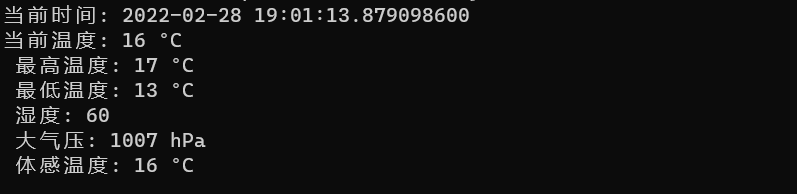

# 实时天气系统命令行工具

## 效果展示

## 引用的crate包如下：

+ `structopt = "0.3.21"`

+ `exitfailure = "0.5.1"`

+ `serde = "1.0.114"`

+ `serde_json = "1.0.56"`

+ `serde_derive = "1.0.114"`

+ `reqwest = {version = "0.11",features = ["json"]}`

+ `tokio = {version = "1",features = ["full"]}`

+ `chrono = { version = "0.4", features = ["serde"] }`

